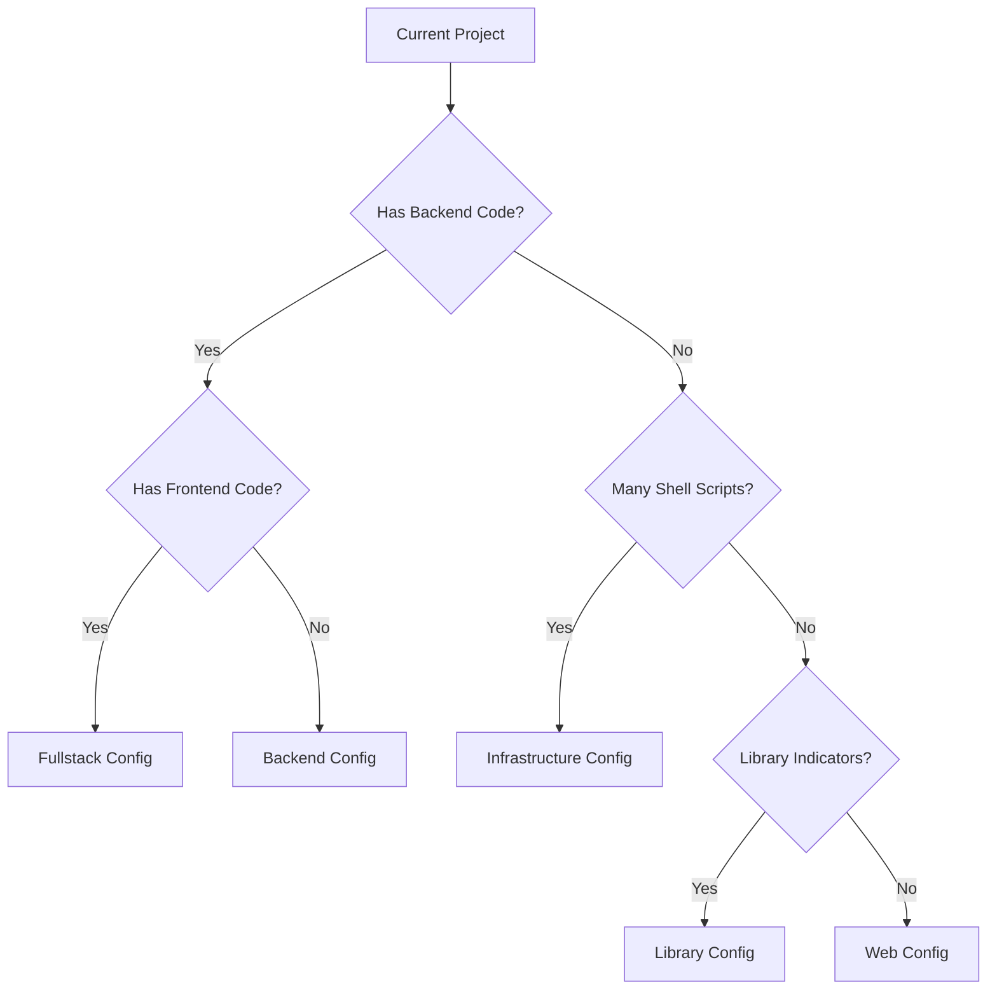

# Project Evolution Patterns for Claude CLI

This document helps Claude CLI **adapt configurations** as projects evolve and grow in complexity.

## 🔄 Evolution Triggers

### Web → Full-Stack
**Trigger Indicators**:
- Backend directories appear: `server/`, `api/`, `backend/`
- Server dependencies added: `express`, `fastify`, `django`, `rails`
- Database files: `schema.sql`, `migrations/`, `prisma/`
- Environment configs: `.env.example`, `config/`

**Claude Action**:
```bash
# Detect evolution
if [[ -d "server" || -d "api" || -f "requirements.txt" ]]; then
  echo "Project evolved to full-stack"
  cp .editorconfig-fullstack .editorconfig
  echo "Upgraded: web → fullstack configuration"
fi
```

### Simple → Infrastructure
**Trigger Indicators**:
- Multiple shell scripts: `scripts/*.sh` (>3 files)
- Container files: `Dockerfile`, `docker-compose.yml`
- CI/CD: `.github/workflows/`, `.gitlab-ci.yml`
- Infrastructure as Code: `terraform/`, `ansible/`

**Claude Action**:
```bash
# Count shell scripts
SHELL_COUNT=$(find . -name "*.sh" | wc -l)
if [[ $SHELL_COUNT -gt 3 ]]; then
  echo "Project evolved to infrastructure"
  cp .editorconfig-infrastructure .editorconfig
  echo "Upgraded: simple → infrastructure configuration"
fi
```

### Single Repo → Monorepo
**Trigger Indicators**:
- Workspace files: `lerna.json`, `nx.json`, `turbo.json`
- Multiple `package.json` files
- Directory structure: `packages/`, `apps/`, `libs/`
- Root `package.json` with `workspaces` field

**Claude Action**:
```bash
# Detect monorepo structure
if [[ -f "lerna.json" || -f "nx.json" || $(find . -name "package.json" | wc -l) -gt 1 ]]; then
  echo "Project evolved to monorepo"
  cp .editorconfig-monorepo .editorconfig
  echo "Upgraded: single → monorepo configuration"
fi
```

## 📊 Complexity Assessment Matrix

### Complexity Indicators
```yaml
low_complexity:
  indicators:
    - files < 50
    - languages = 1
    - no_build_system
  editorconfig: basic (language-specific)

medium_complexity:
  indicators:
    - files 50-200
    - languages = 2-3
    - simple_build_system
  editorconfig: project-type-specific

high_complexity:
  indicators:
    - files > 200
    - languages > 3
    - complex_build_system
    - multiple_environments
  editorconfig: fullstack with overrides
```

## 🎯 Migration Strategies

### Safe Migration Pattern
```bash
# 1. Backup current config
cp .editorconfig .editorconfig.backup

# 2. Apply new config
cp .editorconfig-{new-type} .editorconfig

# 3. Validate no conflicts
editorconfig-checker .

# 4. Auto-fix any issues
if [[ $? -ne 0 ]]; then
  echo "Auto-fixing indentation..."
  fix-shell-indentation.py $(find . -name "*.sh")
fi

# 5. Verify pre-commit passes
pre-commit run --all-files
```

### Rollback Strategy
```bash
# If new config causes issues
if [[ -f ".editorconfig.backup" ]]; then
  mv .editorconfig.backup .editorconfig
  echo "Rolled back to previous configuration"
fi
```

## 🔍 Continuous Monitoring

### Evolution Detection Script
```bash
#!/bin/bash
# detect-evolution.sh - Monitor project evolution

CURRENT_TYPE=$(grep -o "editorconfig-[a-z]*" .editorconfig | head -1 | cut -d- -f2)
NEW_TYPE=$(./detect-project-type.sh)

if [[ "$CURRENT_TYPE" != "$NEW_TYPE" ]]; then
  echo "Project evolution detected: $CURRENT_TYPE → $NEW_TYPE"
  echo "Consider upgrading configuration"
fi
```

## 📋 Evolution Decision Tree



## 🎛️ Advanced Configuration Overrides

### Monorepo Configuration
```ini
# .editorconfig-monorepo
root = true

[*]
charset = utf-8
end_of_line = lf
insert_final_newline = true
trim_trailing_whitespace = true
indent_style = space
indent_size = 2

# Frontend packages
[packages/web/**/*.{js,ts,jsx,tsx}]
indent_size = 2

[apps/frontend/**/*.{js,ts,jsx,tsx}]
indent_size = 2

# Backend packages
[packages/api/**/*.{js,ts,py}]
indent_size = 4

[apps/backend/**/*.{js,ts,py}]
indent_size = 4

# Infrastructure packages
[packages/infrastructure/**/*.{sh,py,tf}]
indent_size = 4

# Shared libraries
[libs/**/*.{js,ts}]
indent_size = 2

# Build tools and scripts
[tools/**/*.{js,sh}]
indent_size = 4
```

## 🚨 Migration Warnings

### Breaking Change Detection
```yaml
breaking_changes:
  indent_style_change:
    from: "spaces"
    to: "tabs"
    action: "Warn user, require confirmation"

  global_indent_change:
    from: "2"
    to: "4"
    impact: "All files affected"
    action: "Auto-fix with backup"

  new_language_rules:
    trigger: "New file types detected"
    action: "Update config, notify user"
```

## 🎯 Success Patterns

### Gradual Evolution
```bash
# Pattern: Start simple, evolve naturally
simple_project →
  add_backend → fullstack_config →
  add_infrastructure → enhanced_fullstack →
  add_packages → monorepo_config
```

### Configuration Validation
```bash
# Always validate after evolution
validate_config() {
  echo "Validating new configuration..."

  # Check syntax
  editorconfig-checker . || return 1

  # Check pre-commit compatibility
  pre-commit run --all-files editorconfig-checker || return 1

  echo "✓ Configuration valid"
}
```

## 📖 Quick Reference

### For Claude CLI:
1. **Before any edit**: Check if project evolved
2. **After adding files**: Re-evaluate project type
3. **Before commit**: Validate configuration
4. **On conflicts**: Auto-fix with appropriate rules

### Emergency Protocol:
If uncertain about evolution: **Use fullstack config** - it safely handles all scenarios.