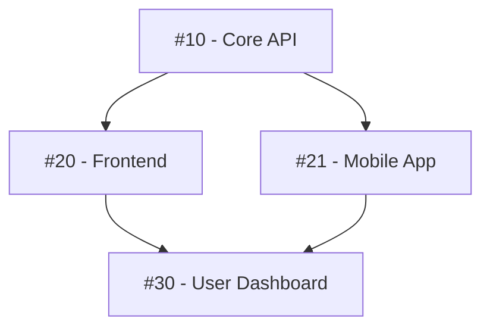

# 🔗 Issue Cross-Reference Index

**⚠️ PERMANENT ISSUE - DO NOT CLOSE**

This issue maintains a comprehensive index of issue relationships, dependencies, and groupings to help navigate the project's issue landscape.

## Issue Categories

### 🐛 Bug Fixes
<!-- List significant bug fix issues with their relationships -->
- #XX - [Title]
  - Blocks: #YY
  - Related: #ZZ
  - Fixed by: #AA

### ✨ Features
<!-- Group feature issues by component or area -->

#### Component: [Name]
- #XX - [Title] (Parent issue)
  - [ ] #YY - [Subtask 1]
  - [ ] #ZZ - [Subtask 2]

#### Component: [Name]
- #XX - [Title]
  - Depends on: #YY
  - Enhances: #ZZ

### 🔧 Refactoring
<!-- Track refactoring efforts and their dependencies -->
- #XX - [Title]
  - Prepares for: #YY
  - Follows: #ZZ

### 📚 Documentation
<!-- Documentation issues and what they document -->
- #XX - [Title]
  - Documents: #YY, #ZZ
  - Part of: #AA

## Dependency Chains

### Critical Path Issues
<!-- Issues that block multiple other issues -->

### Blocked Issues
<!-- Currently blocked issues and their blockers -->

| Blocked Issue | Blocked By | Reason | Expected Unblock Date |
|---------------|------------|---------|---------------------|
| #XX - [Title] | #YY | Waiting for API | YYYY-MM-DD |

## Issue Clusters

### Cluster: [Feature/Epic Name]
<!-- Group related issues that form a larger feature -->

**Parent**: #XX
**Status**: In Progress
**Issues**:
- [ ] #AA - Backend implementation
- [ ] #BB - Frontend UI
- [ ] #CC - Testing
- [ ] #DD - Documentation
- [ ] #EE - Deployment

### Cluster: [Feature/Epic Name]
<!-- Another cluster example -->

## Milestone Groupings

### Milestone: [v1.0.0]
<!-- Issues targeted for this milestone -->

**Must Have**:
- #XX - [Critical feature]
- #YY - [Critical fix]

**Should Have**:
- #AA - [Important feature]
- #BB - [Performance improvement]

**Nice to Have**:
- #CC - [Enhancement]

## Cross-Repository References
<!-- If this project depends on other repositories -->

### Dependencies on [Other-Repo]
- #XX requires Other-Repo#YY
- #AA is blocked by Other-Repo#BB

## Long-Running Threads
<!-- Issues with extensive discussion or research -->

### Research & Investigation
- #XX - [Topic] - 50+ comments, key findings in comments 25, 38, 49
- #YY - [Topic] - Design discussion, decision in comment 67

## Recurring Patterns
<!-- Common issue patterns and their solutions -->

### Pattern: [Name]
**Issues exhibiting this pattern**:
- #XX - Solved by...
- #YY - Solved by...
- #ZZ - Still investigating

## Quick Links

### By Component
- **API**: #10, #15, #23, #45
- **Frontend**: #11, #16, #24, #46
- **Database**: #12, #17, #25, #47
- **DevOps**: #13, #18, #26, #48

### By Priority
- **🔴 Critical**: #XX, #YY
- **🟡 High**: #AA, #BB, #CC
- **🟢 Normal**: #DD, #EE, #FF

---

**Maintenance Notes**:
- Update weekly or when creating issue clusters
- Add all issues with 3+ relationships
- Document critical paths before milestone planning
- Archive completed clusters quarterly