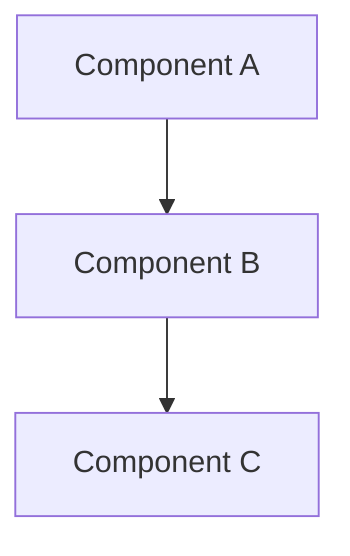
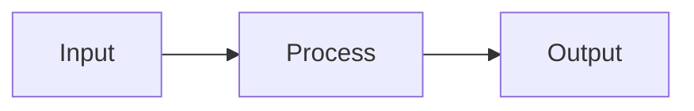

# 🏗️ Architecture Decisions

**⚠️ PERMANENT ISSUE - DO NOT CLOSE**

This issue documents all architectural decisions using the ADR (Architecture Decision Record) format.

## Decision Log

### ADR-001: [Decision Title]
- **Date**: YYYY-MM-DD
- **Status**: Accepted/Rejected/Superseded
- **Context**: What prompted this decision
- **Decision**: What we decided
- **Consequences**: What happens as a result
- **Alternatives Considered**:
  - Option A - Rejected because...
  - Option B - Rejected because...
- **Related Issues**: #XX, #YY

### ADR-002: [Decision Title]
- **Date**: YYYY-MM-DD
- **Status**: Accepted
- **Context**: 
- **Decision**: 
- **Consequences**: 
- **Alternatives Considered**:
- **Related Issues**: 

## Architecture Principles

1. **Principle 1**: Description
   - Rationale
   - Implications

2. **Principle 2**: Description
   - Rationale
   - Implications

## Technology Stack Decisions

### Frontend
- **Framework**: [Choice] - Decided in ADR-XXX
- **State Management**: [Choice] - Decided in ADR-XXX
- **Styling**: [Choice] - Decided in ADR-XXX

### Backend
- **Language**: [Choice] - Decided in ADR-XXX
- **Framework**: [Choice] - Decided in ADR-XXX
- **Database**: [Choice] - Decided in ADR-XXX

### Infrastructure
- **Hosting**: [Choice] - Decided in ADR-XXX
- **CI/CD**: [Choice] - Decided in ADR-XXX
- **Monitoring**: [Choice] - Decided in ADR-XXX

## Design Patterns

### Pattern: [Name]
- **Where Used**: Components/Modules
- **Why**: Rationale
- **Trade-offs**: What we gave up
- **Issues**: #XX, #YY

## Architecture Diagrams

### System Overview

### Data Flow

## Review Schedule
- **Quarterly Review**: Next on YYYY-MM-DD
- **Major Decision Triggers**: List events that require architecture review

---

**Maintenance**: Update whenever making architectural decisions. Review quarterly.