# Release Management Guide

This document describes the release management process for this project.

## Release Channels

### 🚀 Development (`main` branch)
- **Purpose**: Active development and integration
- **Stability**: Unstable, may contain breaking changes
- **Updates**: Continuous
- **Use when**: You want the latest features and don't mind instability

### 🧪 Beta (`beta` branch)
- **Purpose**: Testing and early access
- **Stability**: Mostly stable, suitable for testing
- **Updates**: Weekly (every Monday)
- **Use when**: You want early access to new features with reasonable stability

### ✅ Stable (`stable` branch)
- **Purpose**: Production-ready releases
- **Stability**: Fully stable and tested
- **Updates**: Monthly or as needed
- **Use when**: You need reliability for production use

## Installation by Channel

### For Stable Releases (Recommended)
```bash
# As a git submodule
git submodule add -b stable https://github.com/OWNER/REPO.git path/to/submodule

# Or clone directly
git clone -b stable https://github.com/OWNER/REPO.git
```

### For Beta Testing
```bash
# As a git submodule
git submodule add -b beta https://github.com/OWNER/REPO.git path/to/submodule

# Or clone directly
git clone -b beta https://github.com/OWNER/REPO.git
```

### For Development
```bash
# As a git submodule (tracks main)
git submodule add https://github.com/OWNER/REPO.git path/to/submodule

# Or clone directly
git clone https://github.com/OWNER/REPO.git
```

## Updating

### Update Submodules
```bash
# Update to latest version in tracked branch
git submodule update --remote --merge

# Update and commit
git add path/to/submodule
git commit -m "chore: update submodule to latest version"
```

### Update Direct Clones
```bash
# Fetch and merge latest changes
git fetch origin
git merge origin/stable  # or origin/beta or origin/main
```

## Version Numbering

We follow [Semantic Versioning](https://semver.org/):

- **MAJOR.MINOR.PATCH** for stable releases (e.g., `v1.2.3`)
- **MAJOR.MINOR.PATCH-beta.N** for beta releases (e.g., `v1.2.3-beta.4`)
- **MAJOR.MINOR.PATCH-rc.N** for release candidates (if used)

### Version Bumping Rules

- **MAJOR**: Breaking changes that require user action
- **MINOR**: New features that are backward compatible
- **PATCH**: Bug fixes and minor improvements

## Release Schedule

### Beta Releases
- **When**: Every Monday at 9:00 AM UTC
- **What**: All changes from main branch
- **Version**: Automatic bump based on conventional commits
- **Testing**: One week testing period before stable promotion

### Stable Releases
- **When**: Monthly or when critical fixes are needed
- **What**: Promoted from tested beta releases
- **Version**: Clean version without pre-release suffix
- **Announcement**: GitHub release with full changelog

### Hotfix Releases
- **When**: Critical issues in stable that can't wait
- **What**: Minimal changes to fix specific issues
- **Version**: Patch version bump
- **Process**: Fix → Release → Backport to beta and main

## Conventional Commits

We use [Conventional Commits](https://www.conventionalcommits.org/) for automatic versioning:

### Commit Format
```
<type>(<scope>): <subject>

<body>

<footer>
```

### Types That Trigger Releases

| Type | Release | Version Bump | Example |
|------|---------|--------------|---------|
| `feat` | Yes | Minor | `feat: add new API endpoint` |
| `fix` | Yes | Patch | `fix: resolve memory leak` |
| `feat!` | Yes | Major | `feat!: change API response format` |
| `fix!` | Yes | Major | `fix!: correct behavior (breaking)` |

### Other Types (No Release)
- `docs`: Documentation changes
- `style`: Code style changes
- `refactor`: Code refactoring
- `test`: Test additions/changes
- `chore`: Maintenance tasks

### Breaking Changes
Add `BREAKING CHANGE:` in the commit body or use `!` after the type:
```
feat!: remove deprecated API

BREAKING CHANGE: The /api/v1/users endpoint has been removed.
Use /api/v2/users instead.
```

## Release Process

### 1. Beta Release (Automated)

```mermaid
graph LR
    A[Monday 9AM UTC] --> B[Analyze Commits]
    B --> C[Determine Version]
    C --> D[Merge main → beta]
    D --> E[Tag Beta Version]
    E --> F[Create GitHub Release]
    F --> G[Open Testing Issue]
```


### 2. Stable Promotion (Manual)

```mermaid
graph LR
    A[Select Beta Version] --> B[Run Stable Workflow]
    B --> C[Merge beta → stable]
    C --> D[Tag Stable Version]
    D --> E[Create GitHub Release]
    E --> F[Backport to beta/main]
    F --> G[Announce Release]
```


### 3. Hotfix Process (Emergency)


## Testing Requirements

### Beta Testing Checklist
- [ ] All CI/CD checks pass
- [ ] No regression in existing features
- [ ] New features work as documented
- [ ] Performance is acceptable
- [ ] No security vulnerabilities

### Stable Promotion Criteria
- [ ] Beta has been available for at least 1 week
- [ ] No critical issues reported
- [ ] All planned features are complete
- [ ] Documentation is up to date
- [ ] Migration guide available (if needed)

## Rollback Procedures

### Rolling Back a Release
```bash
# 1. Identify the last good version
git tag -l | grep -E "^v[0-9]+\.[0-9]+\.[0-9]+$" | sort -V

# 2. Create a rollback branch
git checkout -b rollback/vX.Y.Z stable

# 3. Reset to the previous version
git reset --hard vX.Y.Z

# 4. Force push (requires admin rights)
git push --force-with-lease origin rollback/vX.Y.Z:stable

# 5. Create a new patch release noting the rollback
```

### Communication During Rollback
1. Create an issue explaining the rollback
2. Pin the issue to the repository
3. Update the release notes
4. Notify users through available channels

## FAQ

### Q: How do I know which version I'm using?
A: Check the VERSION file or run `git describe --tags`

### Q: Can I skip beta and go straight to stable?
A: No, all changes must go through beta testing first

### Q: How do I request a hotfix?
A: Create an issue with the `critical` and `bug` labels

### Q: What if I need a specific feature faster?
A: You can track the `main` branch, but be aware of potential instability

### Q: How are breaking changes communicated?
A: Through release notes, issues, and the BREAKING CHANGES section

## Contributing to Releases

1. Use conventional commits for all changes
2. Add appropriate labels to PRs
3. Update documentation with your changes
4. Add tests for new features
5. Note breaking changes clearly

## Support

- **Issues**: Report bugs or request features
- **Discussions**: Ask questions or share feedback
- **Security**: Report vulnerabilities privately (see SECURITY.md)